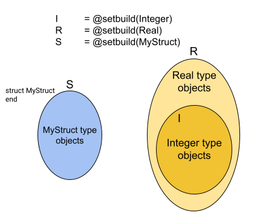

# Set Creation
The `@setbuild` macro in SetBuilders is the primary interface for creating
sets.

With this macro, users can create sets from Julia types, predicates, mappings,
and lists of elements.

## Empty Set and Universal Set
Let's start with the simplest ones: the empty set and the universal set.

```julia
E = @setbuild()     # Empty set
U = @setbuild(Any)  # Universal set

@assert !(1 in E)   # No elements in EmptySet
@assert 1 in U      # Any element is a member of UniversalSet
```
With no argument, @setbuild creates an empty set, which does not contain
any elements. All membership tests with EmptySet returns Boolean `false`.

!!! note
    All @assert tests in the examples of this page should pass.

In Julia, the `Any` type is a special type that sits at the top of the type
hierarchy. With the `Any` type, `@setbuild` creates the universal set, which
includes all objects in Julia. All membership tests with UniversalSet returns
Boolean `true`.

## Set from Julia Types
With Jula type, `@setbuild` creates a set that includes all instances
of that type.

```julia
I = @setbuild(Integer)

@assert 1 in I              # 1 is one instance of an Integer subtype
@assert !(1.0 in I)         # 1.0 is one instance of a Real subtype, not an Integer subtype
```
The set `I` includes instances of all subtypes of `Integer` (`BigInt`,
`Int128`, `Int16`, `Int32`, `Int64`, `Int8`, `UInt128`, `UInt16`, `UInt32`,
`UInt64`, `UInt8`, and `Bool`).

Please note that the set `I` "conceptually includes" such elements,
but does not actually "contain" them. The membership evaluation is performed
"lazily" at the time of checking.

```julia
R = @setbuild(Real)

@assert 1.0 in R            # 1 is one instance of a Real subtype
@assert !(1.0im in R)       # 1.0im is one instance of a Complex type, not a Real subtype
```
Similarly, the set `R` includes all instances of all subtypes of the `Real`
type, encompassing all subtypes of `Integer`, `AbstractFloat`,
`AbstractIrrational`, and `Rational` types.

```julia
struct MyStruct
    a
    b
end

S = @setbuild(MyStruct)

@assert MyStruct(1,2) in S  # MyStruct(1,2) is one instance of a MyStruct type
@assert !(1 in S)           # 1 is not an instance of MyStruct type
```
Note also that `@setbuild` can create sets from user-defined types.
The set `S` includes all instances of the `MyStruct` type.

The following diagram depicts the three sets in the above example.



## Enumerable Set
Similar to Julia's `Set` data structure, `@setbuild` can create a set from
a list of elements.

The brackets(`[` and `]` in the first `@setbuild` argument directs to build
an enumerable set.

```julia
A = @setbuild([1, 2, 3])

@assert 1 in A      # 1 is one of the elements of set A
@assert !(4 in A)   # 4 is not an element of set A
```
The set `A` in the above example is created with three elements.

Note that the Setbuilders Enumerable Set actually 'contains' the elements
in the same way as the `Set` data structure in Julia.

```julia
value = 10

B = @setbuild(Int64[value, 2])

@assert value in B              # `value` defined outside of `@setbuild` is used
@assert !(Int32(value) in B)    # Set B can contain `Int64` type, not `Int32`
@assert !(3 in B)               # 3 is not an element of set B
push!(B, 3)                     # 3 is added into set B
@assert 3 in B                  # Now, 3 is a member of set B
pop!(B, 3)                      # 3 is removed from set B
@assert !(3 in B)               # 3 is not a member of set B
```
Users can specify the type of elements, as shown in the set `B`. There is one
difference in handling the type of elements compared to Julia's `Set`.
When an element is "pushed" into the set, `SetBuilder` enumerable sets do not
promote the element's type, whereas Julia `Set` does.

The above example demonstrates how to add and remove an element to/from
an EnumerableSet using the `push!` and `pop!` functions, similar to the `Set`
in Julia.

```julia
C = @setbuild(Dict{String, String}[])

d1 = Dict{String, String}("a" => "x")
d2 = Dict{String, Integer}("a" => 1)
@assert !(d1 in C)                  # d1 is not a member of set C
push!(C, d1)                        # d1 is added to set C
@assert d1 in C                     # d1 is a member of set C
push!(C, d2)                        # d2 can not be "pushed" to set C, due to type-mismatch
ERROR: push! failed due to element type mismatch: Dict{String, Integer} not in 
ataType[Dict{String, String}].
@assert !(d2 in C)                  # d2 is not a member of set C
```
EnumerableSet can accept instances of all Julia types as a member. Set `C` in
the above example accepts a dictionary data structure with String key and
String value. Note that the square brackets in the `@setbuild` arguement
indicates for creation of an EnumerableSet.

## Cartesian Product Set
In some cases, we may want to create a set by selecting elements from each set
and arranging the chosen elements in order, known as the Cartesian product.

```julia
D = @setbuild((I, I))
```
The set `D` includes all pairs of elements from the set `I`, previously defined
in the example above as a set of Julia `Integer` type.

```julia
F = @setbuild((x, y) in I)
```
The set `F` offers another syntax for creating a set of Integer pairs, similar
to the set `D`.

```julia
G = @setbuild((I^3, z in I))
```
The set `G` demonstrates another syntax for creating a Cartesian product set
with the 4-ary Cartesian product set.

## Predicate Set
Predicates are logical formulas that yield true for set members. In `SetBuilders`,
predicates can be any expressions yielding a `Boolean` result, including functions.

```julia
H = @setbuild(x in I, 0 <= x < 10)

@assert 0 in H
@assert !(10 in H)
```
The set `H` in the above example has two arguments. The first
argument defines the domain of the sets. In other words, all members of
the set `H` should also be members of the set I, defined as an Integer set.
Additionally, all members of these sets should satisfy the Boolean expression
of the second argument.

The following diagram depicts the relation between the domain set `I` and
the predicate set `H`.


```julia
K = @setbuild((x in H, y in J), x < 5 && y > 10)
```
The set `K` demonstrates how to define the domain of a set using multiple
sets.

```julia
L = @setbuild((x in H, y in J), c1*x + c2*y > 0, c1=-1, c2=1)
```
The set `L` shows how to use values defined outside of the `@setbuild` macro.

```julia
N = @setbuild(x in @setbuild(Real), x > 0)
```
The set `N` illustrates that the `@setbuild` macro can be nested within
another `@setbuild` macro.

## Mapped Set
With a Mapped Set, users can create a set using mappings from one set to
another.

```julia
O = @setbuild(x in H, z in I, z = x + 5, x = z - 5)
```
A "Mapped Set" should have at least four arguments.

The first argument defines the source set, or domain in mathematical term,
of a mapping. The mapping starts from the elements of the set `H`.

The second argument defines the destination set , or codomain, of a mapping.
The mapping arrives at the elements of the set `I`.

The third argument defines a "forward" mapping from the source set (`H`, domain)
to the destination set (`I`, codomain). The mapping at the third argument
defines the way how to generated an element(or elements) in the codomain.

The fourth argument defines a "backward" mapping from the destination set
(`I`, codomain) to the source set (`H`, domain). The mapping at the fourth
argument defines the way how to generated an element(or elements) in the
domain.


```julia
function myfunc(x)
    x - 5
end

P = @setbuild(x in J, z in I, z = x + 5, x = func(z), func=myfunc)
```
The set `P` demonstrates how to use a function defined outside of `@setbuild`
to create a mapping.

```julia
Q = @setbuild((x in H, y in J), z in S, z = mystruct(x, y),
                (x, y) = (z.a, z.b), mystruct=MyStruct)
```
The set `Q` shows that a mapped set can map to a user-defined type.
